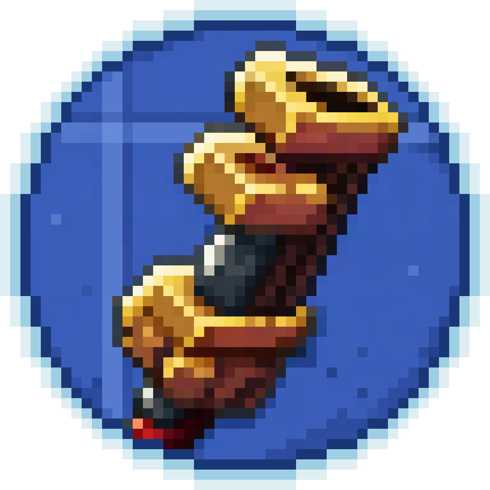
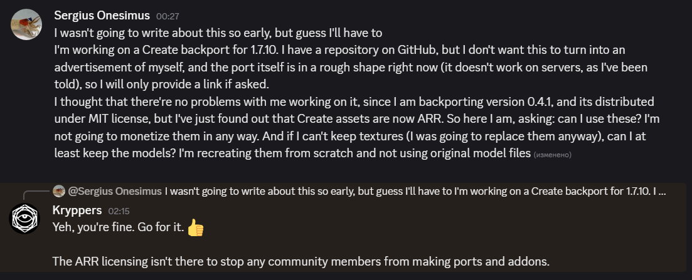

# ReCreate

*You are in command — from the walls of Create to the ground of the past.*

A backport of the legendary [Create mod](https://github.com/Creators-of-Create/Create) for **Minecraft 1.7.10**, bringing its iconic rotational mechanics and kinetic machines to the classic era of the game.

---

> 🚫 **PLEASE do not include this mod in any publicly available modpack** until an official release. This is done solely to slow news spreading before the official launch. Once ReCreate is officially released, you are free to include it.

---

## About

ReCreate is a work-in-progress backport of the [Create mod](https://github.com/Creators-of-Create/Create) to Minecraft 1.7.10. Create is known for its rotational mechanics — instead of magic machines and GUIs, everything runs on **physical force**, **kinetic energy**, and **mechanical contraptions**.

This is a **very early build**. The mod is under active development. Expect crashes, missing features, and incomplete content. It is not intended for survival play yet.

---

## ⚙️ Implemented Features

The following machines and systems are currently present and functional:

**Kinetic Energy**
- Cogwheels and Axles — transfer rotational power across structures
- Gearboxes and Clutches — redirect and control rotation
- Creative Motors — infinite rotation source for testing
- Water Wheels — generate power from flowing water
- Mechanical Belts — transfer rotational power and transport items

**Contraptions**
- Bearings — rotate structures around a central point
- Windmill Bearings — generate power from wind using sails
- Mechanical Pistons — move structures orthogonally

---

## 📦 Download

**Option 1 — Pre-release (recommended)**

Download the latest pre-release directly from the [Releases page](https://github.com/Apostrcfo2/ReCreate/releases). Look for the latest `v0.0.1` pre-release and download the `.zip` file.

**Option 2 — Latest build**

Go to the **[Actions tab](https://github.com/Apostrcfo2/ReCreate/actions)** → click the latest successful run → scroll to **Artifacts** → download `mod-jar`.

> The Actions build is always more up-to-date but may be less stable than the pre-release.
> Pre release builds are published by a different author. Please submit all the issues you have to the [original repo 'issues' page](https://github.com/Gordon-Frohman/ReCreate/issues)

---

## 🔧 Dependencies

All files below must be present in your `mods` folder for the mod to work.

| Mod | Description | Download |
|---|---|---|
| Minecraft Forge 1.7.10-10.13.4.1614 | Mod loader | [Download](https://files.minecraftforge.net/net/minecraftforge/forge/index_1.7.10.html) |
| UniMixins | Mixin implementation library | [Download](https://github.com/LegacyModdingMC/UniMixins/releases) |
| Metaworlds Mixins | A library used for contraptions creation. Required alongside UniMixins | [Download](https://github.com/Gordon-Frohman/Metaworlds-Mixins/releases) |
| TileEntity Breaker | An optional library used for rendering destruction textures on shafts, cogwheels, belts, etc. Usage is highly recommended. | [Download](https://github.com/Gordon-Frohman/TileEntityBreaker/releases) |

---

## 🚀 Installation

1. Install **Minecraft Forge** `1.7.10-10.13.4.1614`
2. Download all dependencies from the table above
3. Download the **ReCreate** jar from the Releases page or Actions tab
4. Place **all** jars into your `.minecraft/mods` folder
5. Launch Minecraft with the Forge profile

---

## ⚖️ Legal Matters

This project is heavilly based on source code of [Create 0.4.1](https://github.com/Creators-of-Create/Create/tree/mc1.17/dev) with necessary modifications made by [Gordon-Frohman](https://github.com/Gordon-Frohman).

ReCreate contains textures and sounds from **[Create 0.4.1](https://github.com/Creators-of-Create/Create/tree/mc1.17/dev)**. All Create assets are distributed under the **All Rights Reserved (ARR)** license. 

*Permission granted by the Create team for use of assets in ports and addons.*

---

## Credits

- **[Simibubi & the Create team](https://github.com/Creators-of-Create/Create)** — creators of the original Create mod
- **[Gordon-Frohman](https://github.com/Gordon-Frohman/ReCreate)** — creator of this 1.7.10 port
- **[LegacyModdingMC](https://github.com/LegacyModdingMC/UniMixins)** — UniMixins
